# predictive_maintenance  

  

# milling cutter(tool wear (flank wear).)  

 
  

  

UC Berkeley milling data set  
https://www.tvhahn.com/posts/milling/  
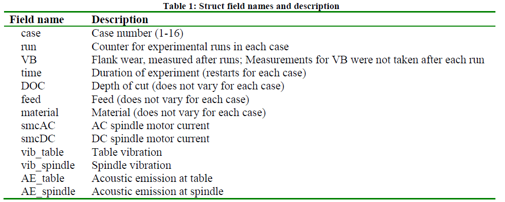  
The data set included experimental data under milling machine
 operating conditions, with a particular focus on tool wear (flank wear).   
 Data were collected by three different sensors (acoustic emission sensor, 
 vibration sensor, and current sensor) and were acquired at each location.  

 A 'maintenance' column has been added for maintenance (tool change) information.
This is because it is inferred that maintenance (tool replacement) was performed on areas where wear was extremely reduced in the process of increasing wear.  

**Things to keep in mind**  
We have added a maintenance column, where maintenance=1, assuming that the cutter was replaced at the end of the cutter life.
However, the data shows that the cutter was probably replaced only because of switching between different cutting conditions.  

Therefore, the simulation of the RUL estimation below may be unrelated to the cutter life.  

- Time stamp items added as appropriate  

## milling cutter(tool wear (flank wear).) 1
  

### remaining useful life (RUL)  
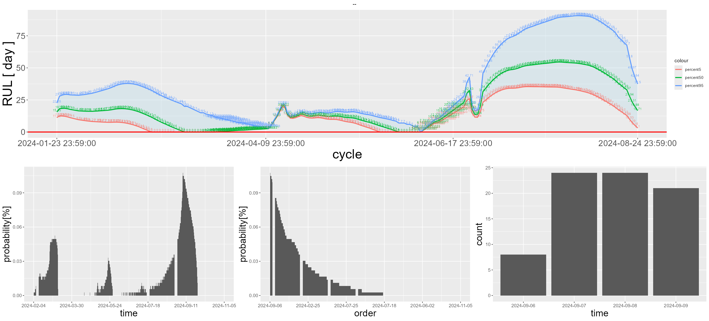  

The data set is useful for measuring tool wear and predicting remaining tool life,
 including tool replacement.

Tool wear is measured by removing the tool and observing it under a microscope.  
Therefore, the tool wear value (column VB) is a discontinuous observed value.  

Although the simulation of RUL estimation predicts tool wear conditions,
 in reality it is difficult to remove the tool and observe it under a microscope
  in the same way as when this data set was created.  
Therefore, the following example shows a RUL estimation simulation without tool wear values (column VB).  

## milling cutter(tool wear (flank wear).) 2 
  

### remaining useful life (RUL)  
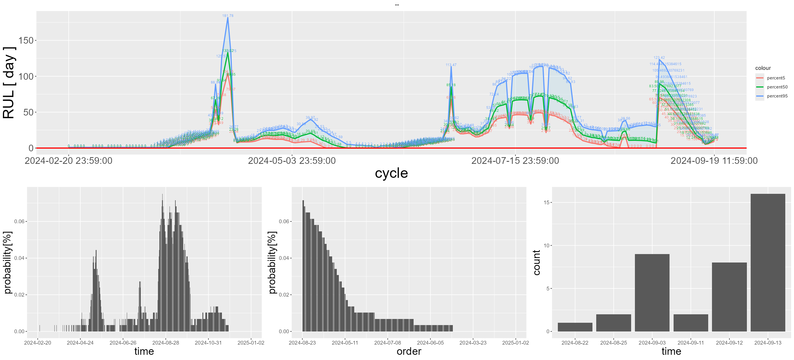  

The threshold could not be fixed if wear was not used as an indicator of residual life
 and **smcAC** (AC spindle motor current), which is easier to observe, was used instead.
 Therefore, the RUL estimation is quite unstable.  

 This is probably due to the mixing of processing conditions (case).  

##  milling cutter(tool wear (AE_table).)  

“AE_table” (Acoustic Emission at Table) is the data of
 Acoustic Emission (AE) measured at the table (fixed surface of the workpiece),
  which shows a similar trend to wear, so we estimated RUL with this item.
 

### remaining useful life (RUL)  
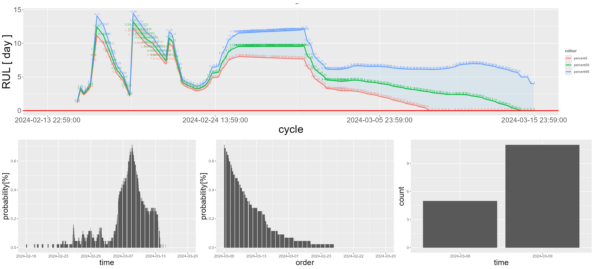 

 ---

# Battery Research Data  

 
  

  
https://calce.umd.edu/data#CS2  

'Discharge Capacity (mAh)' -> 'capacity'  
'Internal Resistance (Ohm)' -> 'resistance'  
'Constant Current Charging Time (s)' -> 'CCCT'  
'Constant Voltage Charging Time (s) -> 'CVCT'

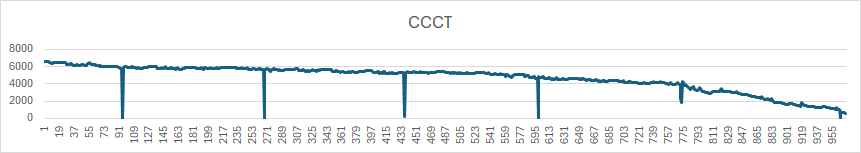  
  
- Time stamp items added as appropriate  

### remaining useful life (RUL)
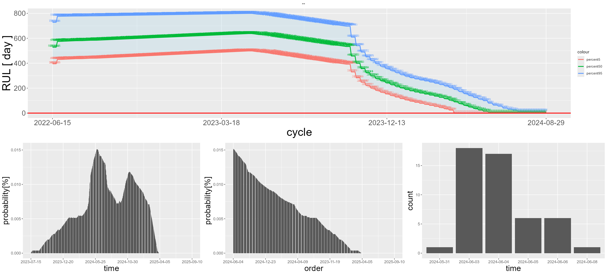  
  
 --- 
  
# NASA Turbofan Jet Engine Data Set  

 
  

  
https://www.kaggle.com/datasets/behrad3d/nasa-cmaps  

## NASA_Turbofan_Jet_Engine_Data_train_FD001_Uint1  
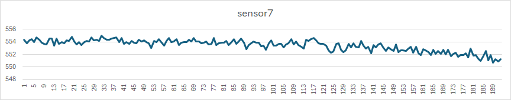  
  
- Time stamp items added as appropriate  

### remaining useful life (RUL)
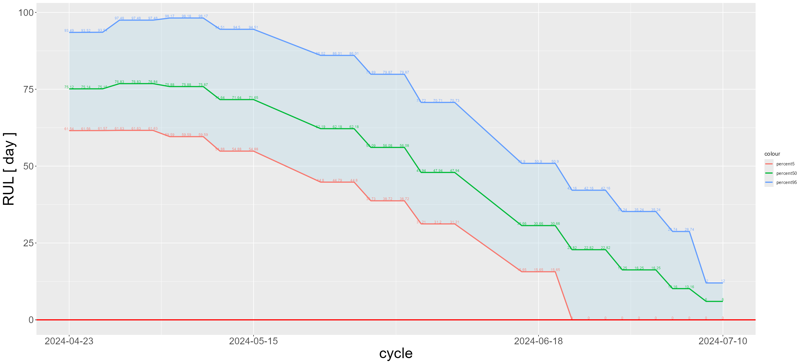  

## NASA_Turbofan_Jet_Engine_Data_train_FD004_Uint1  
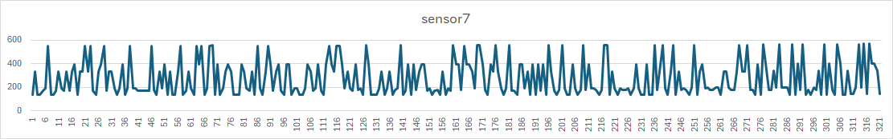  
  
- Time stamp items added as appropriate  

### remaining useful life (RUL)
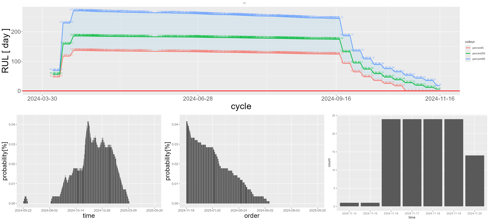  
  
---

# WindTurbineHighSpeedBearingPrognosis-Data  
https://github.com/mathworks/WindTurbineHighSpeedBearingPrognosis-Data  
https://www.kaggle.com/datasets/luishpinto/wind-turbine-high-speed-bearing-prognosis-data  

(https://github.com/Sanaxen/predictive_maintenance/releases/download/untagged-905f728bcfa3c90b7849/WindTurbineHighSpeedBearingPrognosis-Data-main.zip)

  
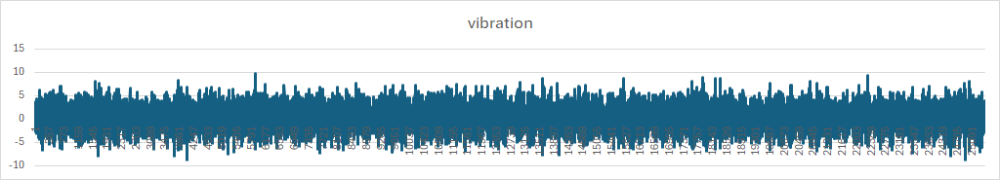  
  
- Time stamp items added as appropriate

### remaining useful life (RUL)
  

---
## requirements  

- [R-4.2.3](https://www.r-project.org/)
- [rtools](https://cran.r-project.org/bin/windows/Rtools/)
- [nkf](https://github.com/kkato233/nkf/releases )  
  using nkf to encode the character code.  
- 

## setup procedure
Install R(rtools) Modify the following files.

First line of init.bat (set drive=**c:**)
If you installed to drive D, set drive=**D:**
Make the same modification to tmp/init.bat

**install.bat** will automatically configure the necessary settings and make it available for use.  

See **md/predictive_maintenance_en.pdf** for details.  

## Data set(Datasets for various RUL estimation)  
https://www.nasa.gov/intelligent-systems-division/discovery-and-systems-health/pcoe/pcoe-data-set-repository/

---
Notes.  
The plot of the probability density function is fairly approximate.  
The confidence intervals for the predictions are tentatively calculated and not yet correct.  

Parts such as creating file lists from directories, processing files, and using batch startup are OS-dependent (Windows).  
To run on non-Windows operating systems, OS-dependent parts must be modified.  

