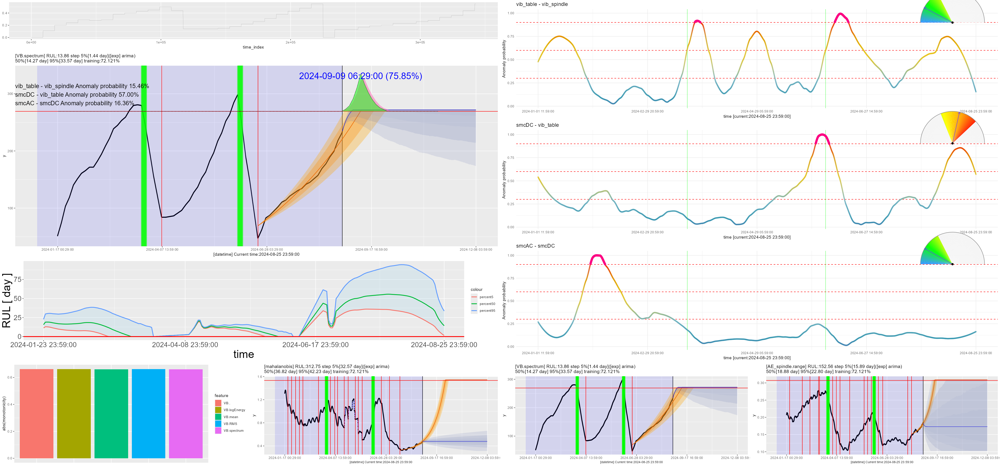
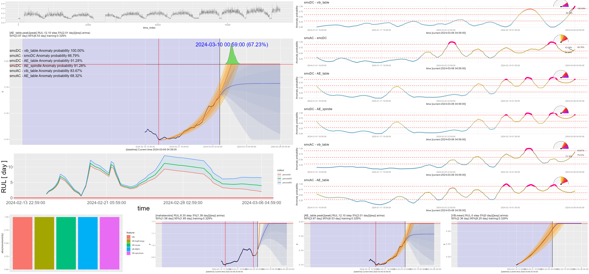
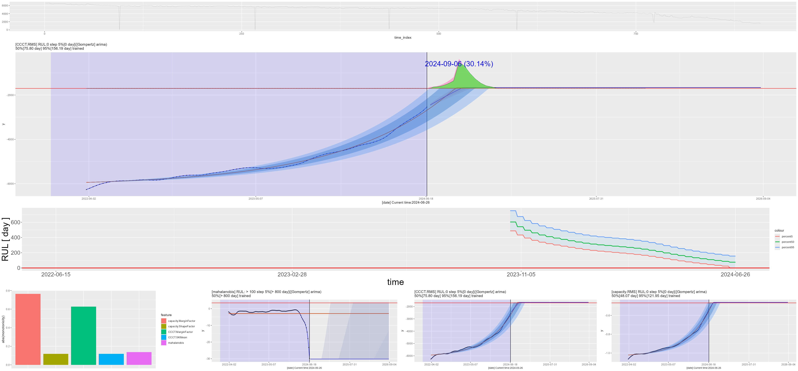
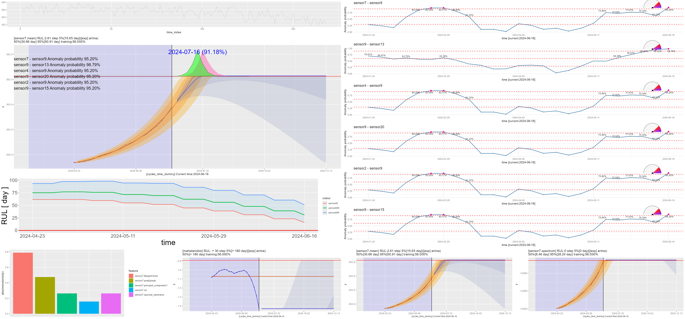
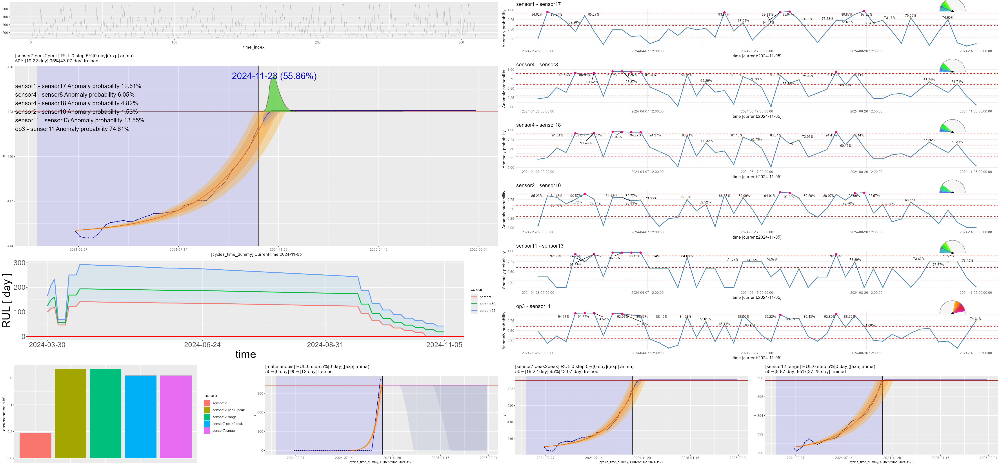
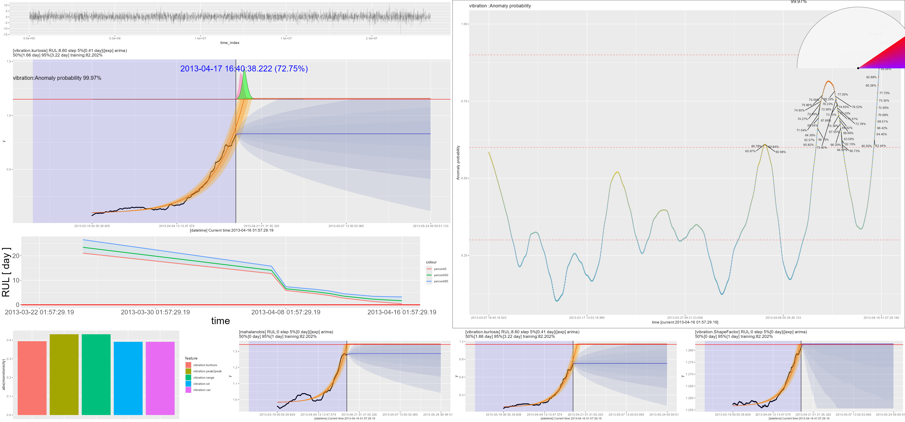
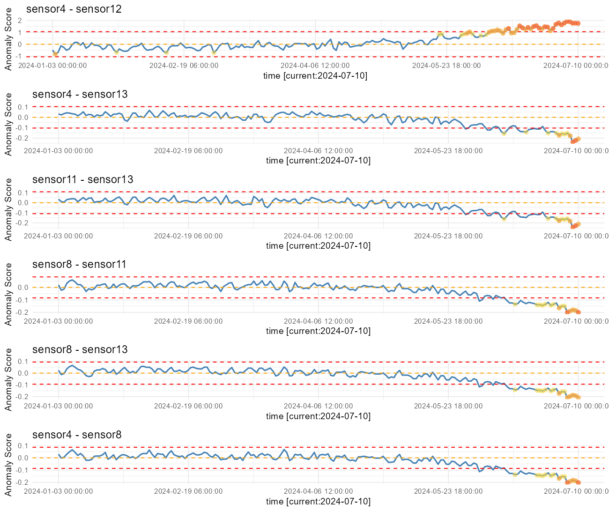

# predictive_maintenance & Detection precursor phenomena

C# Windows GUI application  
---

  

# Inspired by MATLAB's predictive maintenance functionality  

This project is inspired by the **Predictive Maintenance Toolbox** in **MATLAB**. And it is developed in **R**.
Although influenced and referenced, the implementation is almost completely unique and will not yield the same results.
See the implementation details for more information.
One unique implementation is the availability of the **Gompertz degradation model**.  
  
https://jp.mathworks.com/help/predmaint/index.html?s_tid=CRUX_lftnav  
https://jp.mathworks.com/help/predmaint/ug/rul-estimation-using-rul-estimator-models.html#mw_40162c89-fafb-4610-bd53-b1d5525acafd  
https://jp.mathworks.com/help/predmaint/ref/exponentialdegradationmodel.html  

## exsamples  

-  milling cutter(tool wear (flank wear))  
	- milling cutter(tool wear (flank wear)) 1 
	- milling cutter(tool wear (flank wear)) 2  
-  Battery Research Data 
-  NASA Turbofan Jet Engine Data Set  
	-  NASA_Turbofan_Jet_Engine_Data_train_FD001_Uint1  
	-  NASA_Turbofan_Jet_Engine_Data_train_FD004_Uint1 
-  WindTurbineHighSpeedBearingPrognosis-Data  

---  

# milling cutter(tool wear (flank wear))  

 
  

  

UC Berkeley milling data set  
https://www.tvhahn.com/posts/milling/  
  
The data set included experimental data under milling machine
 operating conditions, with a particular focus on tool wear (flank wear).   
 Data were collected by three different sensors (acoustic emission sensor, 
 vibration sensor, and current sensor) and were acquired at each location.  

 A 'maintenance' column has been added for maintenance (tool change) information.
This is because it is inferred that maintenance (tool replacement) was performed on areas where wear was extremely reduced in the process of increasing wear.  

**Things to keep in mind**  
We have added a maintenance column, where maintenance=1, assuming that the cutter was replaced at the end of the cutter life.
However, the data shows that the cutter was probably replaced only because of switching between different cutting conditions.  

Therefore, the simulation of the RUL estimation below may be unrelated to the cutter life.  

- Time stamp items added as appropriate  

## milling cutter(tool wear (flank wear)) 1
  

The data set is useful for measuring tool wear and predicting remaining tool life,
 including tool replacement.

Tool wear is measured by removing the tool and observing it under a microscope.  
Therefore, the tool wear value (column VB) is a discontinuous observed value.  

Although the simulation of RUL estimation predicts tool wear conditions,
 in reality it is difficult to remove the tool and observe it under a microscope
  in the same way as when this data set was created.  
Therefore, the following example shows a RUL estimation simulation without tool wear values (column VB).  

## milling cutter(tool wear (flank wear)) 2 
  

The threshold could not be fixed if wear was not used as an indicator of residual life
 and **smcAC** (AC spindle motor current), which is easier to observe, was used instead.
 Therefore, the RUL estimation is quite unstable.  

 ---

# Battery Research Data  

 
  

  
https://calce.umd.edu/data#CS2  

'Discharge Capacity (mAh)' -> 'capacity'  
'Internal Resistance (Ohm)' -> 'resistance'  
'Constant Current Charging Time (s)' -> 'CCCT'  
'Constant Voltage Charging Time (s) -> 'CVCT'

  
  

**Gompertz degradation model**  

- Time stamp items added as appropriate  

 --- 
  
# NASA Turbofan Jet Engine Data Set  

 
  

  
https://www.kaggle.com/datasets/behrad3d/nasa-cmaps  

## NASA_Turbofan_Jet_Engine_Data_train_FD001_Uint1  
  
  

- Time stamp items added as appropriate  

## NASA_Turbofan_Jet_Engine_Data_train_FD004_Uint1  
  
  
- Time stamp items added as appropriate  

---

# WindTurbineHighSpeedBearingPrognosis-Data  
https://github.com/mathworks/WindTurbineHighSpeedBearingPrognosis-Data  
https://www.kaggle.com/datasets/luishpinto/wind-turbine-high-speed-bearing-prognosis-data  

(https://github.com/Sanaxen/predictive_maintenance/releases/download/untagged-905f728bcfa3c90b7849/WindTurbineHighSpeedBearingPrognosis-Data-main.zip)

  
  
  
- Time stamp items added as appropriate

### remaining useful life (RUL)
  

---  

---

## requirements  

- [R-4.2.3](https://www.r-project.org/)
- [rtools](https://cran.r-project.org/bin/windows/Rtools/)
- [nkf](https://github.com/kkato233/nkf/releases )  
  using nkf to encode the character code.  
- 

## setup procedure
Install R(rtools) Modify the following files.

First line of init.bat (set drive=**c:**)
If you installed to drive D, set drive=**D:**
Make the same modification to tmp/init.bat

**install.bat** will automatically configure the necessary settings and make it available for use.  

See **md/predictive_maintenance_en.pdf** for details.  

## Data set(Datasets for various RUL estimation)  
https://www.nasa.gov/intelligent-systems-division/discovery-and-systems-health/pcoe/pcoe-data-set-repository/

---
Notes.  
The plot of the probability density function is fairly approximate.  
The confidence intervals for the predictions are tentatively calculated and not yet correct.  

Parts such as creating file lists from directories, processing files, and using batch startup are OS-dependent (Windows).  
To run on non-Windows operating systems, OS-dependent parts must be modified.  

---  
# Implementation Details  

### Exponential Degradation Model
$` \eta(x) \equiv s \cdot tanh(x) `$   
s = Upper limit of exponential function domain that can be evaluated numerically  

$` \Large y(t) = c + exp(\eta(\alpha))\ exp(exp(\eta(\beta))\cdot t+ \eta(\delta)) `$  

$`a=\exp(\eta(\alpha)),\quad b=\exp(\eta(\beta))\quad  d=\eta(\delta)`$    
s = Upper limit of exponential function domain that can be evaluated numerically  
  
$` y(t) = c + a \cdot \exp(b \cdot t + d)`$  

for y(t) to be monotonically increasing as t increases, its derivative

$` y'(t) = a \cdot b \cdot \exp(b \cdot t + d)`$  
must always be positive. Since the exponential function $exp(b \cdot t + d)`$  is always positive, the condition for monotonic increase is:

$` a \neq 0\ and\ b \neq 0`$  
$` a \cdot b > 0`$  

In practice, it is common to assume \(a > 0\) and \(b > 0\).

### Gompertz Degradation Model  

$` \Large y(t) = c + exp(\eta(\delta)) \cdot exp(\frac{exp(\eta(\alpha))}{exp(\eta(\beta))}\ (1-exp(-exp(\eta(\beta)\cdot t)) ))`$  

$`a=\exp(\eta(\alpha)),\quad b=\exp(\eta(\beta)) \quad d=\exp(\eta(\delta))`$   

$`  y(t) = c + d \cdot exp(\frac{a}{b}\ (1-exp(-b\cdot t)) )`$  

$` a > 0 \ and\  b > 0 \ and\  d > 0`$  

### linear Degradation Model  
$` \Large y(t) = a + b\cdot t `$  

#### output file  
wrk/[csv_file_name]feature_params.csv  

|feature|threshold|	ymax|	ymin|	count|	a|	b|	c|	d|t_scale| RUL|
|---|---|---|---|---|---|---|---|---|---|---|
|feature name|	threshold value | feature ymax|feature	ymin|	Number of times considered best|	a|	b|	c|	d|t_scale| RUL| 

|unit| fit_start_time| model |fit_start_index|delta_index|delta_time|
|---|---|---|---|---|---|
|time of unit|fit_start timestamp| "exp" or "Gompertz" or "lm"|fit_start_index|delta_index|delta_time|

**fitting_solver** = "auto" model is dynamically selected.
Which model is adopted is determined by comparing 
AICs and adopting the model with the smaller AIC.  
**AIC:Akaike's Information Criterion**

**fitting_solver**="auto" or "exp" or "Gompertz"  

If the specified model cannot be applied, a linear model is automatically and dynamically selected,
 but if b < 0, no linear model is selected.   
 In that case, only a time series forecasting model such as arima is applied.  
Since time-series forecasting models such as arima are always calculated at the same time 
for reference purposes, there is no need to specify the application of time-series forecasting models.  
Therefore, a linear model cannot be specified for fitting_solver.  

#### note  
arima, auto.arima, prophet, and ets can be selected for time series forecasting, 
but currently the selection is ignored and ets (Exponential Smoothing State Space Model (ETS)) is applied.  

$` \Large *`$  Currently, “arima” is displayed on the graph.  

initial_pm <- function(sigin_arg)  
''

	#Predictive Model Selection
	use_auto_arima <<- F
	use_arima <<- F
	use_ets <<- F
	use_plophet <<- F  
''  

You need to comment out this part to make it work.
However, it is not clear if it will work correctly as it has not been fully tested.  

''

	#Predictive Model Selection
	#use_auto_arima <<- F
	#use_arima <<- F
	#use_ets <<- F
	#use_plophet <<- F  
''
---
#### Exponential Degradation Mode

$` \Large y(t) = c + a\ exp(b\cdot t+ d) `$  

Scaling time axis and undetermined coefficientsEstimating a,b,c,d  
$`y ={y_{1}, y_{2}, \cdots y_{n}}`$  
$`t ={1, 2, \cdots n}`$  
$`\acute{t} = t / (n + h)`$   
$`t\_scale =  (n + h)`$ 

$`\acute{RUL} =\Large \frac{ log(\frac{threshold - c}{a})}{b} - d `$  
$` threshold > c`$ 

#### Gompertz Degradation Mode  
 
$` \Large  y(t) = c + d \cdot exp(\frac{a}{b}\ (1-exp(-b\cdot t)) )`$  

$`  \acute{RUL} =  \Large \frac{-log(\frac{\frac{log(threshold-c)}{d}}{\frac{a}{b}}-1 ) }{b}`$  

$`  1 > \frac{\frac{log(threshold)-c)}{d})}{\frac{a}{b}}-1  > 0`$  

#### linear Degradation Model  
$` \Large y(t) = a + b\cdot t `$   

$`  \acute{RUL} =  \Large \frac{threshold-a}{b}`$  

$` threshold > a \ and\  b > 0`$  

---
Inverse scaling to the RUL obtained from the estimated model yields the correct RUL.  

$`RUL = fit\_start\_index + \acute{RUL}  \cdot t\_scale  \cdot delta\_index`$  

Since the input data is moving-average smoothed, the data interval is also expanded, and one line after moving-average smoothing is not one line of the actual input data.
Therefore, it is necessary to apply delta_index to convert it to the number of rows for the input data.  

After this conversion process, the RUL is converted to the number of rows for the input data.

To match this to the actual time, it must be scaled to the time interval of the input data.  

$`RUL = RUL \cdot delta\_time [time\ of\ unit]`$  

If the elapsed time from **fit_start_time** is **t**, RUL can be calculated as follows  
$`RUL = RUL \cdot delta\_time [time\ of\ unit]  - t [time\ of\ unit]``$  

---  

# Detection precursor phenomena
  

Train for a period of time while reading the data.
Test the **Spearman correlation** between each data and select pairs with constant correlation.

For the (x,y) pairs, fit $`y=f(x)`$ and $`x=f(y)`$ with **lightgbm** (Light Gradient Boosting Machine ), and use the model with the highest accuracy in the **SMAPE** accuracy index as the training model.

$`SMAPE = \frac{1}{n}\sum_{t=1}^{n} \frac{2 \, |F_t - A_t|}{|F_t| + |A_t|} \times 100 `$  

$` F_t `$ is the forecast (predicted value) at time $`( t ),  `$   
$` A_t `$ is the actual (observed) value at time $`( t ),`$  
$`( n ) `$ is the total number of data points. 

## Sequential Bayesian Updating
For observed value x , the posterior probability of being in an abnormal state  

$` \Large P(abnormal|x) = \frac{P(x|abnormal)P(abnormal)}{P(x|normal)P(normal)+P(x|abnormal)}`$  

For a given observed value x, compare both normal and abnormal state hypotheses and calculate the probability of being in an abnormal state as a number using Bayesian estimation

Each time a new observation is obtained, the method uses the previous posterior probability as the next prior probability and updates it.

In this method, “evidence” accumulates over time, so the probability of an anomaly naturally increases as the system degrades.  

$` mean(abnormal) = mean(normal) + k \cdot sd(normal) `$   
$` sd(abnormal) = c \cdot sd(normal) `$   

**Note**  
At this time, the following methods have been changed.  

---
## Mathematical Derivation: Z-score → P-value → Rarity Score

This document clearly explains how to convert a **Z-score** into a **two-sided P-value** and subsequently into a convenient "rarity score," a metric ranging from **0 (common)** to **1 (rare)**.

---

### 1 Definition of the Z-score

Given an observed data point $` x `$, a population mean $` \mu `$, and a population standard deviation $` \sigma `$, the Z-score is defined as:

$`
Z = \frac{x - \mu}{\sigma}
`$

The Z-score measures how many standard deviations an observed value $` x `$ is away from the mean.

---

### 2 Definition of the Two-sided P-value

The two-sided P-value represents the probability of observing a value at least as extreme as the observed data point (either above or below the mean), assuming a normal distribution:

Mathematically:

$`
{prob\_two\_sided} = P(|X - \mu| \geq |x - \mu|)
`$

For a standard normal distribution (mean = 0, standard deviation = 1), this simplifies to:

$`
{prob\_two\_sided} = 2 \times [\,1 - \Phi(|Z|)\,]
`$

- Where $` \Phi(\cdot) `$ is the cumulative distribution function (CDF) of the standard normal distribution (e.g., `pnorm` in R).

---

### 3 Converting the Two-sided P-value into a Rarity Score

To provide a more intuitive measure of rarity or unusualness, define a "rarity score" as follows:

$`
{rarity\_score} = 1 - {prob\_two\_sided}
`$

Expanding this expression:

$`
\begin{aligned}
1 - \text{prob\_two\_sided} &= 1 - 2[\,1 - \Phi(|Z|)\,] \\
&= 1 - 2 + 2\Phi(|Z|) \\
&= 2\Phi(|Z|) - 1
\end{aligned}
`$

---

### 4 Final Simplified Formula

Thus, the final simplified formula linking the Z-score to a rarity score is:

$`
\boxed{\text{rarity\_score} = 2\Phi(|Z|) - 1}
`$

- Where:
  - $` \Phi `$ is the standard normal cumulative distribution function (CDF).
  - $` Z `$ is the absolute value of the Z-score.

---

## ✅ **Interpretation**

- **Rarity score ≈ 1**: Indicates an extremely rare event, highly unlikely by random chance.
- **Rarity score ≈ 0**: Indicates a common event, frequently occurring by random chance.

This derivation clearly demonstrates the intuitive relationship between Z-scores, two-sided P-values, and the resulting rarity score.

---
---  
## References  
https://calce.umd.edu/data#CS2  
https://www.tvhahn.com/posts/milling/  
https://github.com/mathworks/WindTurbineHighSpeedBearingPrognosis-Data  
https://www.kaggle.com/datasets/luishpinto/wind-turbine-high-speed-bearing-prognosis-data  
https://jp.mathworks.com/help/predmaint/ref/exponentialdegradationmodel.html  
https://github.com/xxl4tomxu98/NASA-Jet-Engine-Maintenance  
