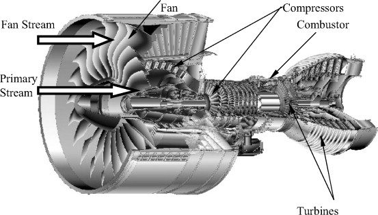
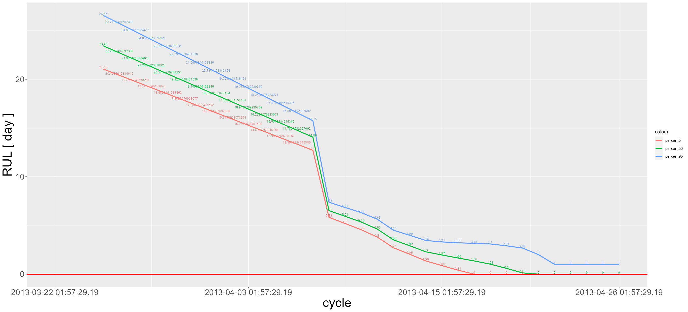

# predictive_maintenance  

## NASA Turbofan Jet Engine Data Set  

 
  

  
https://www.kaggle.com/datasets/behrad3d/nasa-cmaps  

## NASA_Turbofan_Jet_Engine_Data_train_FD001_Uint1  
  
- Time stamp items added as appropriate

## NASA_Turbofan_Jet_Engine_Data_train_FD004_Uint1  
  
- Time stamp items added as appropriate

## WindTurbineHighSpeedBearingPrognosis-Data  
https://github.com/mathworks/WindTurbineHighSpeedBearingPrognosis-Data  
https://www.kaggle.com/datasets/luishpinto/wind-turbine-high-speed-bearing-prognosis-data  

  
  
- Time stamp items added as appropriate

### remaining useful life (RUL)
  

### using nkf to encode the character code.  
https://github.com/kkato233/nkf/releases  

---
Notes.  
The plot of the probability density function is fairly approximate.  
The confidence intervals for the predictions are tentatively calculated and not yet correct.  

