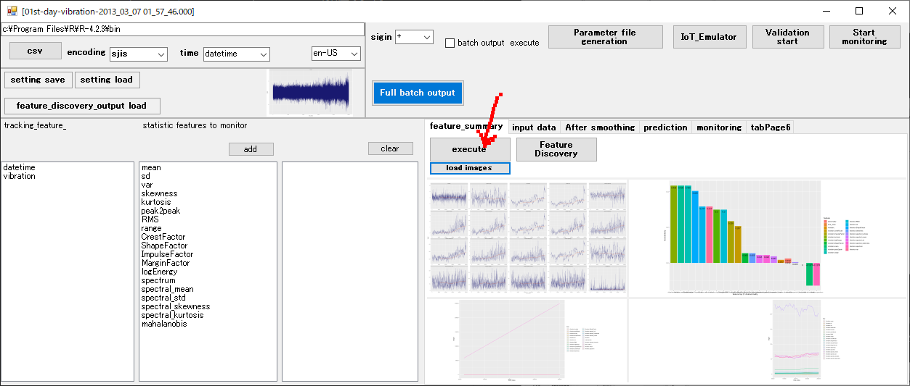
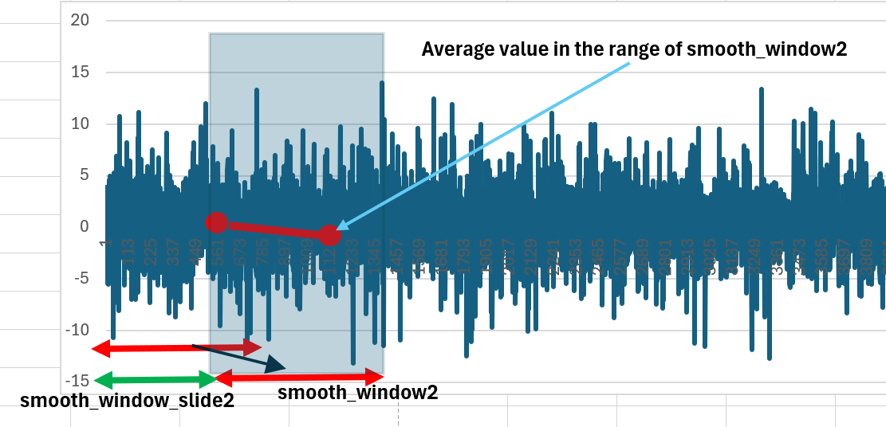

# pm.bat

## Set the installation location for R

This only needs to be done once.

## Language Settings
You can choose between Japanese or English. After setting, restart to apply the specified language.

## Importing CSV Data
CSV data can be either accumulated data from periodic saving or consolidated CSV files. One or multiple files are acceptable. Place these CSV files under an appropriately named folder. Use the "CSV" button to access the folder and select the first CSV file.

Select the first CSV file.

## Timestamp Parameter Settings
When CSV data is loaded, each item and a list of investigable features are automatically set.

First, select and specify the item representing the timestamp.

## Summary of Features

xxxx_feature_summary_visualization.bat ("xxxx" is determined from the name of the imported CSV file.)

Generates a batch for visualizing the summary of features for each data item.

**batch output & execute** If the checkbox is ON, batch generation and execution are performed. This process takes time as it is done for all items.

# Parameter Settings for Estimating Remaining Useful Life (RUL)

You can set parameters either manually or semi-automatically. You can also adjust specific parameters manually after semi-automatic setting.

## Various Settings

## Feature Selection
No setup is required for semi-automatic configuration. Select the items and features for tracking RUL and press the **add** button.

- **sigin**
Specify whether to reverse the sign of the feature.

Features need to increase over time to exceed the threshold as the lifespan decreases.

If this feature represents RUL, it will likely show a sharp drop after maintenance, making it critical for decision-making.

Two items and features must be set for tracking RUL. Additional settings will not be tracked.

Also, **sigin** and other parameters are shared. The second listed feature is tracked as reference data. In the later **Forecast Execution (Validation)** step, thresholds will be adjusted automatically.

---
### Input Data Settings
Specify the time unit of the data, the approximate amount of observational data generated each time, the amount used for training, and the maximum amount to retain, including historical data. If the maximum retention is exceeded, the oldest data is automatically deleted.

The parts highlighted in red can be set automatically. Typically, this parameter is fine at 0. If the input data is huge, sampling can be done based on **smooth_window** and **smooth_window_slide** settings.

- **unit_of_time**
  Time unit of the data.
- **unit_of_record**
  Time interval between rows.
- **one_input**
  Amount of CSV data provided each time. This is the row count of CSV files provided during operation. CSV files are automatically split based on this setting and generated in the files folder. These files are copied to the Untreated folder, processed one file at a time, and moved from Untreated to the Processed folder during operation.
- **max_train_span**
  Amount used for training (needed for threshold estimation and Mahalanobis distance calculation). If data accumulation exceeds this amount, threshold estimation stops, and the Mahalanobis distance model is generated using data up to this point.
- **max_retained_length**
  Maximum retention of historical data. Set it significantly larger than max_train_span.
- **smooth_window**
  Specifies the window size for sampling input data.
- **smooth_window_slide**
  Specifies the movement of the sampling window for input data.

### Feature Tracking Settings

The parts highlighted in red can be set automatically.

- **sampling_num**
  Specify the number of samples to fit when creating a prediction line without referencing all historical data.
- **lookback**
  Specify the window size for creating statistical feature data from input data.

- **lookback_slide**
  Specify the window movement amount for creating statistical feature data from input data.

- **smooth_window2**
  Specify the window size for smoothing features.

- **smooth_window_slide2**
  Specify the movement of the smoothing window for features.

- **smoother_span**
  Smooth the point sequence before fitting the input data. Smaller values retain the original fluctuations; larger values make it smoother.
- **gap_ratio**
  Reset the fitting start point to the position of a sudden change when input data trends rise or fall sharply. Typically, after maintenance, trends change drastically, so fitting starts from this point.

- **train_num**
  Specify the amount of past data used to create a prediction line. Negative values use all past data. Positive values truncate past data and use only the specified number of points to create the prediction line.
- **monotonicity_num**
  Specify the amount of past data used for monotonicity checks. Negative values use all past data, while positive values truncate past data and use only the specified number of points.
- **threshold initial value**
  Automatically adjust the threshold until the total input data exceeds **max_train_span**.
- **threshold**
  Specify a value as the threshold if automatic adjustment is not performed. This only applies to the first listed feature.

### Prediction Conditions Settings

- **max_prediction_length**
  Specify the number of future points to predict from the last observed point.

- **forecast_time_unit**
  Specify the time unit for displaying the predicted results.

- **failure_time_init**
  If the number of maximum prediction points until the threshold is exceeded is surpassed, it is judged that the threshold will not be exceeded even infinitely.

---

## Batch Generation

- [1] Generate Parameter File
  xxxx_parameters.r ("xxxx" is determined from the name of the imported CSV file.)
- [2] Generate Data Emulation Batch
  xxxx_IoT_Emulator.bat  ("xxxx" is determined from the name of the imported CSV file.)
  Emulates transfer to the folder (**work\Untreated**) for processing CSV files.
- [3] Perform Prediction (Validation)
  xxxx_test.bat ("xxxx" is determined from the name of the imported CSV file.)
  Execute the batch and open the **monitoring** tab to visualize the prediction simulation according to the settings.

Appropriate thresholds are set during this execution. **Batches must be executed in the order 1, 2, 3.** During this validation execution, parameters are adjusted, and a file **"work/xxxx_feature_param.csv"** is generated and recorded.

- [4] Execute Operation
  xxxx_execute.bat ("xxxx" is determined from the name of the imported CSV file.)
  Generate a batch for actual operation. Once operation starts, the folder (**work\Untreated**) for processing CSV files is periodically accessed, and files are processed if present. Files are split and processed according to the **one_input** setting. The **Full batch output** button allows batch output of all files at once. However, even if the **batch output & execute** checkbox is ON, the batch is not executed.

### Batch Execution

If the **batch output & execute** checkbox is ON, batch generation and execution are performed. After batch generation, individual batches can also be executed from the command prompt. The batch files are output, and they can be executed from the command prompt. Regardless of the method, **Batch Generation** steps 1 and 2 must be executed beforehand. Additionally, if **Feature Summary**

  is checked, batch generation and execution are performed if the **batch output & execute** checkbox is ON.

## Parameter Auto-Discovery (Semi-Automatic Parameter Setting)

xxxx_feature_discovery.bat ("xxxx" is determined from the name of the imported CSV file.)
Generate a batch for parameter auto-discovery. If the **batch output & execute** checkbox is ON, batch generation and execution are performed. This batch starts parameter auto-discovery when executed. The **Timestamp Parameter Settings** step must be completed in advance.

The parameters explored include **smooth_window**, **smooth_window_slide**, **lookback**, **lookback_slide**, **smooth_window2**, **smooth_window_slide2**, **threshold**, and **sigin**.

During this exploration, all files in the folder specified during **Importing CSV Data** are combined, and the entire observation period is targeted for exploration.

When batch execution ends, the most suitable parameter settings and feature graphs are displayed.

Press the **view tabelLayout** button to display all candidate feature graphs deemed suitable.

From this list, select appropriate feature graphs or use the trackbar to display suitable feature graphs and confirm the selection with the **select** button. Up to two features can be selected.

Double-click a selected graph to deselect it. For tracking RUL, the topmost selected graph is used as the primary feature, while the second graph is used as a supplemental feature. Be sure to select two features.

## About Selecting Features and CSV Data Items
Features for tracking RUL must have an upward trend and exhibit a rapid decrease after maintenance.

The entire observation period is targeted, but if a column named **maintenance** (with a value of 1 during maintenance periods) exists, the data from the start to the next maintenance and the subsequent maintenance position are extracted to check if they meet the tendencies of features tracking RUL. If no **maintenance** column exists, the data is assumed to start at the beginning and end just before the termination point as if maintenance was performed there. The tendency to meet RUL tracking feature cr...

Confirm with the **confirm and reflect** button.

Next, press the **feature_discovery_output load** button to set all the parameters and selected features from exploration and selection.

## Operation Execution
Using the parameter settings generated in **Forecast Execution (Validation)**
**"work/xxxx_feature_param.csv"**, RUL is tracked during operation. Once started, the folder (**work\Untreated**) for processing CSV files is periodically accessed, and files are processed if present.
