# pm.bat

## Rのインストール場所を設定

これは最初の１回目だけでよい。

## 言語設定
日本語か英語が選択できる。
設定したら再度起動することで指定した言語になる。

## ファイルのエンコーディング設定
現在はUTF-8固定で、入力csvファイルは全て自動的にUTF-8に変換されます。
また、出力ファイルは全てUTF-8で出力されます。

## csvデータの投入
csvデータは定期保存などで蓄積したデータかそれを一旦まとめたcsvファイルなど複数でも一つでもよい。
それらのcsvファイルを適当なフォルダー名配下に置かれているものとする。
「csv」ボタンでフォルダーにアクセスして最初のcsvファイルを選択します。

csvデータの列名に　**.** を使わないようにして下さい。特に注意して欲しいのはR言語は変数として使えない文字を　**.** に自動変換してしまいます。

R の変数名のルールに適合しない列名を自動的に修正します。このとき、以下のルールが適用されます：  

空白（スペース） → "." に変換  
例: "column name" → "column.name"  
特殊文字（-, +, ?, ! など） → "." に変換  
例: "column-name" → "column.name"  
数字から始まる名前 → "X" を付加  
例: "123data" → "X123data"  
重複するカラム名 → "." を付加して一意にする  
例: c("A", "A") → c("A", "A.1")  

事前に　**.** に変換されないように列名を **_** に置き換えるなどして下さい。  

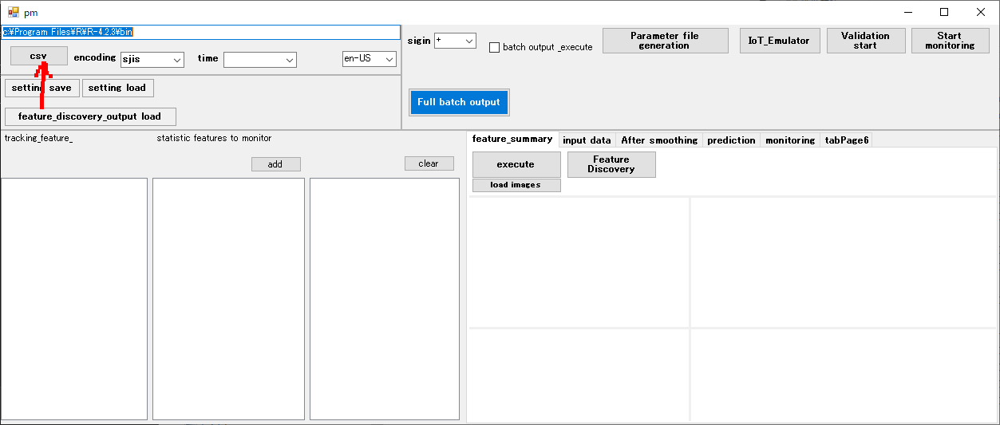
最初のcsvファイルを選択
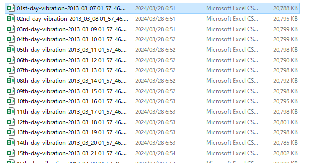

## タイムスタンプ パラメータ設定
csvを読み込むと各項目と調査可能な特徴量リストが自動的に設定されます。
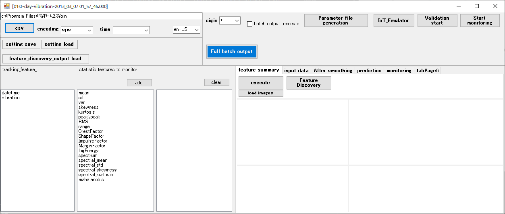

まず、タイムスタンプを表す項目を選んで指定します。

## 特徴量のサマリー

xxxx_feature_summary_visualization.bat ("xxxx"は投入されたcsvファイル名から決められます。)

データの各項目ごとの特徴量の概要を可視化のためのバッチを生成します。

**batch output & execute**　チェックボックスがONになっているとバッチ生成とバッチ実行が行われまがこの処理はすべての項目に対して行うため時間がかかります。

# Remaining Useful Life (RUL) を推定するためのパラメータ設定

設定には全て自分で設定する場合と半自動で設定する方法が可能です。
半自動で設定してから特定のパラメータだけを自分で設定しなおすことも可能です。

## 各種設定

## 特徴量の選択
半自動で設定する場合は設定は不要です。
RULをトラッキングする項目と特徴量を選択して**add**ボタンを押します。

- **sigin**
特徴量の符号を反転するかを指定します。
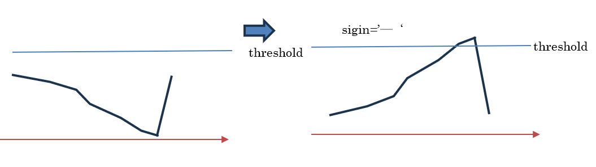
寿命が短くなるにつれて閾値を越えようとするようにするには特徴量が時間とともに上昇していく必要があります。  
  
この特徴量がRULを表すものであればメンテンス後には急降下する特徴もあるはずで重要な判断になります。

RULをトラッキングする項目と特徴量は2個設定が必要です。
それ以上設定してもトラッキング対象にはなりません。

また、**sigin**やその他のパラメータは共通となります。2番目にリストされた特徴量は参考データとしてトラッキングされます。後述の **予測の実施(検証)** では閾値に関しては自動的に調整されます。

---
### 入力データ設定
データの時間単位、毎回生成されてくる観測データの大体の量、トレーニングに使われる量、過去のデータを含めて最大どれだけを保持し続けるかを指定します。
過去のデータを含めて最大保持量を超えると自動的に一番古い部分から削除していきます。

赤枠の部分は自動設定可能です。
このパラメータは通常は０で問題ありません。入力データが巨大ない場合に指定された**smooth_window**と **smooth_window_slide**　でサンプリングしたデータを使うようにできます。

- **unit_of_time**
  データの時間単位
- **unit_of_record**
　一行間の時間間隔
- **one_input**
　毎回提供されるcsvのデータ量 
  これは実際に運用時に提供されるcsvの行数です。ここの設定に従ってcsvファイルは自動的に分割されてfilesフォルダーに生成されます。これらのファイルはUntreatedフォルダーにコピーされて1ファイル毎に読み込まれて行きます。運用時はUntreatedフォルダーを監視してファイルが転送されるごとに読み込まれてUntreatedフォルダーから削除されてProcessedフォルダーに移動されます。
- **max_train_span**
 トレーニングに使われる量(閾値推定とMahalanobis' distanceの計算で必要になります)
 入力データの蓄積がこの量を超えると閾値推定が完了してそれ以降は閾値は更新されません。
 またMahalanobis' distanceのモデルもこの時点までのデータを作って生成されます。従ってこの設定を十分に取っておかないと閾値の更新は直ぐに停止してしまい入力データが閾値を遥かに超えていく事が起きてしまいます。
- **max_retained_length**
　過去のデータを含めて保持し続ける最大量です。max_train_spanよりも十分大きく設定して下さい。
- **smooth_window**
入力データのサンプリングする際のウィンドウサイズを指定する。
- **smooth_window_slide**
入力データのサンプリングする際のウィンドウの移動量を指定する。
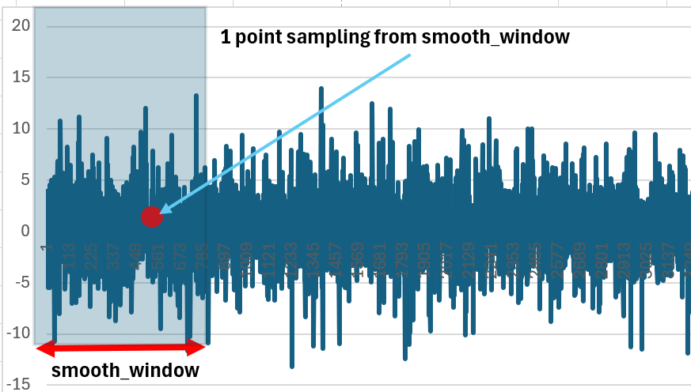

### 特徴量トラッキング設定
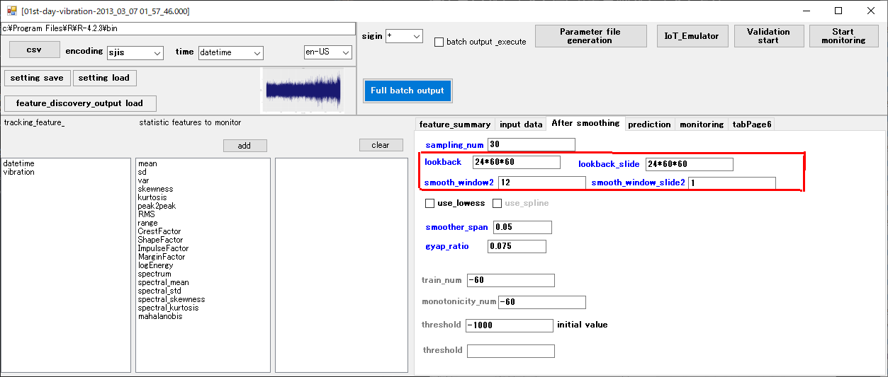
赤枠の部分は自動設定可能です。

- **sampling_num**
予測線を作成する際に、すべての履歴データを参照せずに、指定された量をサンプリングしてフィットを試みる。
- **lookback**
入力データの基本統計量を特徴量とするデータを作成する際のウィンドウサイズを指定する。

- **lookback_slide**
入力データの基本統計量を特徴量とするデータを作成する際のウィンドウ移動量を指定する。

- **smooth_window2**
特徴量を平滑化する際のウィンドウサイズを指定する。
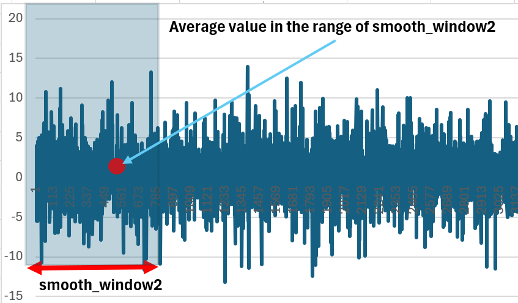

- **smooth_window_slide2**
特徴量を平滑化する際のウィンドウの移動量を指定する。

- **smoother_span**
入力データをフィッティングする前にフィッティングする点列を平滑化する。値が小さいほど元の揺らぎ通りになる。値を大きくすると滑らかになる。
- **gap_ratio**
  入力データの傾向が急激に上がるか下がった場合にフィッティングの開始点を急激に変化した位置にリセットする。一般的にはメンテナンスをした直後は急激に変化するためフィッティングはメンテナンス直後からになるためです。
  
- **train_num**
予測線を作成するために使用する過去のデータ量を指定する。負の値はすべての過去データを使用する。 正の値は過去のデータを切り捨て、指定値の点数だけ過去のデータのみを使用して予測線を作成します。負の値、正の値はどちらもその絶対値の点数を最低必要点数として指定する意味で使われる

- **monotonicity_num**
単調性チェックに使用する過去のデータ量を指定する。負の値はすべての過去データを使用する。 正の値は過去のデータを切り捨て、予測線を作成するために指定値の点数の過去データのみを使用する。負の値、正の値はどちらもその絶対値の点数を最低必要点数として指定する意味で使われる
- **threshold initial value**
閾値の自動調整開始値、入力データの総量が**max_train_span**を超えるまでは更新し続ける。
- **threshold**
閾値の自動調整は行わずに指定した値を閾値とする場合は値を指定する。
これは1番目にリストされた特徴量のみに対して有効になります。

### 予測条件の設定

- **max_prediction_length**
最後に観測されたポイントから将来を予測するポイント数を指定します。

- **forecast_time_unit**
予測された結果の表示をどの時間単位で表示するかを指定する。

- **failure_time_init**
閾値を予測線が超えるまでの最大予測点数でこれを超える場合は閾値を無限時間後でも越えないと判断する。

---

## バッチ生成

- [1] パラメータファイルの生成
xxxx_parameters.r ("xxxx"は投入されたcsvファイル名から決められます。)
- [2] データ生成エミュレートバッチの生成
xxxx_IoT_Emulator.bat  ("xxxx"は投入されたcsvファイル名から決められます。)
csvファイルを処理するためのフォルダー（**work\Untreated**）への転送をエミュレートします。
- [3] 予測の実施(検証) 
xxxx_test.bat ("xxxx"は投入されたcsvファイル名から決められます。)
バッチを実行して**monitoring**タブを開くと設定に従った予測のシミュレーションが可視化されます。
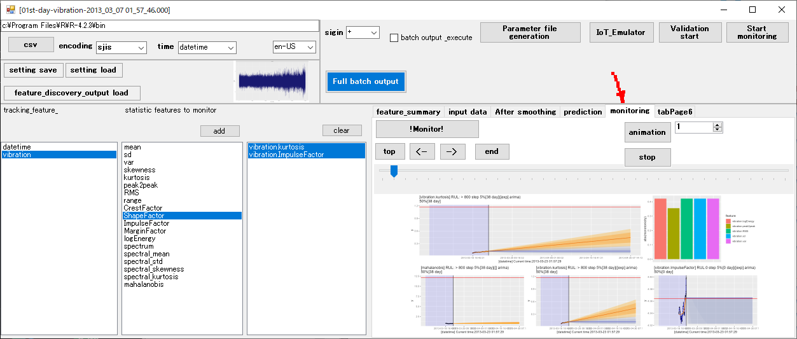
 

 この実施で適切な閾値が設定されます。**バッチは１，２，３の順で実行する必要**があります。この検証の実施で適切なパラメータが調整されて
 **"work/xxxx_feature_param.csv"** というファイルが生成されて記録されます。"xxxx"は投入されたcsvファイル名から決められます。
 

 - [4] 運用の実施
 xxxx_execute.bat ("xxxx"は投入されたcsvファイル名から決められます。)
 実際に運用するためのバッチを生成します。運用が開始されるとcsvファイルを処理するためのフォルダー（**work\Untreated**）に定期アクセスしてファイルがあれば処理します。ファイルは**one_input**設定に従って切断して**one_input**毎に投入されたように処理していきます。　**Full batch outpu**　ボタンで全ファイルを一気に出力することが可能ですが**batch output & execute**　チェックボックスがONになっていてもバッチが実行されることはありません。

### バッチ実行
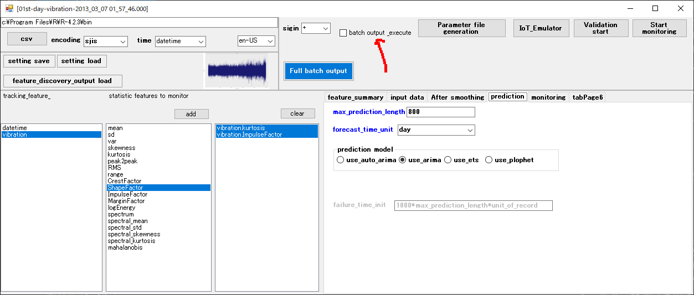
 
 **batch output & execute**　チェックボックスがONになっているとバッチ生成とバッチ実行が行われます。
バッチ生成の後は個別にバッチをコマンドプロンプトから実行することも可能です。
それにはバッチフィルは出力されているのでそのバッチファイルをコマンドプロンプトから実行します。
どの方法でも**バッチ生成**の１，２は必ず事前実行しておくことが必要です。また**特徴量のサマリー**

においても**batch output & execute**　チェックボックスがONになっているとバッチ生成とバッチ実行が行われます。

## パラメータ自動探索（半自動でパラメータ設定）
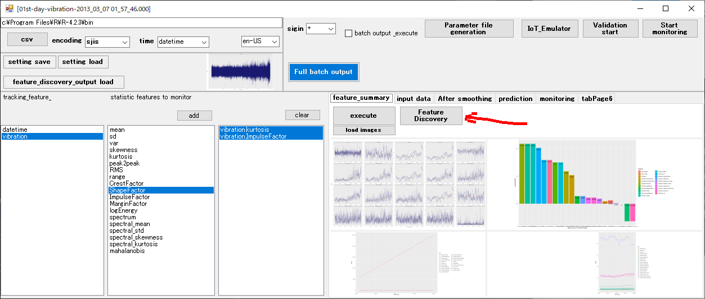
xxxx_feature_discovery.bat ("xxxx"は投入されたcsvファイル名から決められます。)
パラメータ自動探索を行うバッチを生成します。**batch output & execute**　チェックボックスがONになっているとバッチ生成とバッチ実行が行われます。
このバッチを実行するとパラメータ自動探索が開始されます。
事前に　**タイムスタンプ パラメータ設定**　は必須です。

探索されるのは**smooth_window**, **smooth_window_slide**、**lookback**, **lookback_slide**,**smooth_window2**,**smooth_window_slide2**,**threshold**,**sigin**　です。

この探索では**csvデータの投入**で指定したファイルの存在するフォルダーにあるすべてファイルを結合して観測済の全期間を探索対象にします。

バッチ実行が終わるともっとも適切と思われるパラメータ設定と特徴量グラフが表示されます。

**view tabelLayout** ボタンを押すと適切と思われる特徴量グラフの候補がすべて表示されます。

適切と思われる特徴量グラフをこの一覧から選択するかtrackbarを移動させて適切と思われる特徴量グラフを表示させて**select**ボタンで選択確定することができます。選択できるの２個までです。
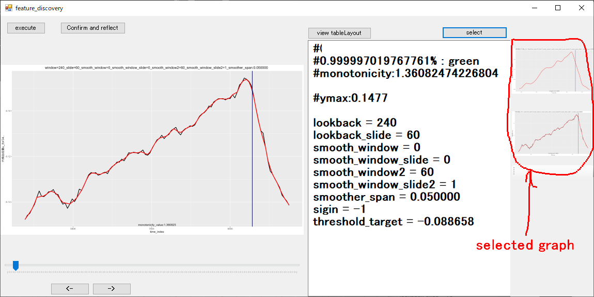
selected graphをダブルクリックすることで選択から外すことができます。
RULをトラッキングする特徴量としてselected graphの一番上のものが選ばれますが２番目のものは補助的にRULをトラッキングします。
かならず、２個を選択してください。

## 選択すべき特徴量とcsvのデータ項目に関して
RULをトラッキングする特徴量は必ず右肩上がりでメンテナンス後に急速に下がる性質があるはずです。  
  
観測済の全期間を探索対象にしますがデータ項目に**maintenance**（メンテナンスした時期だけ１がセットされている）という列がある場合はデータ先頭から次のメンテナンスをした位置からさらに次のメンテナンスをした位置を切り出してRULをトラッキングする特徴量に当てはまる傾向を示しているかを検査します。**maintenance**項目が無い場合はデータの先頭から終端として終端の少し手前でメンテナンスしたものとしてRULをトラッキングする特徴量に当てはまる傾向を示しているかを検査します。  

**confirm and reflect**ボタンで確定します。

続いて**feature_discovery_output load** ボタンを押すと探索・選択した特徴量とパラメータが全て設定されます。

## 運用の実施
**予測の実施(検証)** で生成されたパラメータ設定
**"work/xxxx_feature_param.csv"**
と各パラメータ設定（**パラメータファイルの生成**)を使ってRULをトラッキングしていきます。運用が開始されるとcsvファイルを処理するためのフォルダー（**work\Untreated**）に定期アクセスしてファイルがあれば処理します。

---
# Appendix  

## 1. 時間領域の特徴量

### Mean（平均）
- **特性:** 振動信号全体の中心傾向を示します。
- **有利な点:** 長期的なレベル変動やバイアスの変化を把握できますが、急激なインパルス現象には敏感ではありません。

### Std（標準偏差）
- **特性:** 信号のばらつきや散らばりを表現します。
- **有利な点:** 振動レベルの変動が大きくなると、故障の進行や異常の兆候を示唆します。

### Skewness（歪度）
- **特性:** 信号分布の左右対称性（非対称性）を評価します。
- **有利な点:** 正常状態では対称的な分布が、故障初期では片側に偏るため、早期の異常検知に寄与します。

### Kurtosis（尖度）
- **特性:** 信号のピークの鋭さや裾の重さを評価します。
- **有利な点:** 故障進行時に突発的なピークが発生し、尖度が高くなることで、インパルス性の変化を敏感に捉えます。実際、例では最も重要な指標として扱われています。

### Peak-to-Peak（ピークトゥピーク値）
- **特性:** 信号内の最大値と最小値の差を示します。
- **有利な点:** 全体の振幅変動を直接評価でき、急激な衝撃やスパイクの発生を捉えます。

### RMS（実効値）
- **特性:** 信号の二乗平均平方根により、エネルギー量を示します。
- **有利な点:** 振動エネルギー全体を評価し、エネルギーが増加すると劣化の進行を反映します。

### Crest Factor（クレストファクター）
- **特性:** 最大値とRMSの比率を計算します。
- **有利な点:** 急激なピークが目立つ場合に、その影響を強調し、インパルス性の変化の検出に有用です。

### Shape Factor（シェイプファクター）
- **特性:** RMSと平均絶対値の比率を算出します。
- **有利な点:** 波形の形状特性を評価し、正常な波形と異常な波形の違いを識別するのに役立ちます。

### Impulse Factor（インパルスファクター）
- **特性:** 最大値と平均絶対値の比率です。
- **有利な点:** 非常に大きなピークが現れる場合、その影響を際立たせ、初期の故障兆候を示唆します。

### Margin Factor（マージンファクター）
- **特性:** 最大値を平均絶対値の二乗で割った値を求めます。
- **有利な点:** 突出したピークが存在する場合、その影響をさらに強調し、敏感な故障検出を実現します。

### Energy（エネルギー）
- **特性:** 信号全体の二乗和を算出します。
- **有利な点:** 振動信号の総エネルギーを示し、劣化に伴うエネルギー増加を反映します。

---

## 2. 周波数領域の特徴量（スペクトルカルチシス）

### SKMean（スペクトルカルチシスの平均）
- **特性:** 複数の周波数帯におけるスペクトルカルチシスの平均値を計算します。
- **有利な点:** 周波数領域全体でのインパルス性の傾向を把握し、劣化の全体的な進行を評価します。

### SKStd（スペクトルカルチシスの標準偏差）
- **特性:** 各周波数帯のカルチシス値のばらつきを示します。
- **有利な点:** 局所的な異常がある場合、そのばらつきにより異常箇所を特定するのに役立ちます。

### SKSkewness（スペクトルカルチシスの歪度）
- **特性:** カルチシス値の分布の非対称性を評価します。
- **有利な点:** 特定の周波数帯で一方向に偏る場合、早期の故障兆候として利用できます。

### SKKurtosis（スペクトルカルチシスの尖度）
- **特性:** カルチシス値の分布の尖り具合を評価します。
- **有利な点:** 異常な周波数成分（アウトライヤー）の影響を強調し、故障の初期段階を捉えます。

---

## 3. 総合的なメリット

- **多角的な信号解析:**  
  時間領域と周波数領域の両方から特徴量を抽出することで、基線変動やエネルギー増加といった全体的な変化と、急激なインパルス現象など局所的な変化の両方を捉えることができます。

- **早期故障検知:**  
  特に尖度、クレストファクター、スペクトルカルチシスといった指標は、初期の劣化や異常の兆候を敏感に捉えるため、故障の早期発見に寄与します。

- **堅牢な健康指標の構築:**  
  複数の特徴量を統合（例：PCAによる次元削減）することで、より信頼性の高い健康指標が作成され、残存寿命（RUL）の予測に役立ちます。

https://jp.mathworks.com/help/predmaint/ug/wind-turbine-high-speed-bearing-prognosis.html